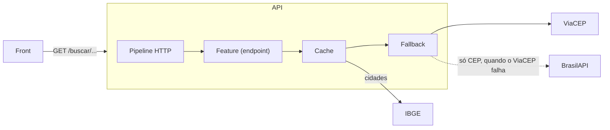

# Arquitetura

Como uma requisição atravessa a API, do HTTP até as fontes externas e de volta.

## Visão geral

A API não tem banco de dados. Ela recebe a consulta, busca nas fontes públicas (ViaCEP, BrasilAPI e IBGE), padroniza a resposta e guarda o resultado em cache.



## Organização do código

O projeto usa **Vertical Slice Architecture**: cada endpoint é uma fatia completa, em um arquivo só, em vez de espalhado por camadas (controller, service, repository). Os detalhes estão no [ADR 0009](decisions/0009-vertical-slices-com-minimal-apis.md).

| Pasta | O que tem |
|---|---|
| `Features/` | Um arquivo por endpoint, com a rota, a validação dos parâmetros e o handler |
| `Common/` | O que as features compartilham: modelos (`Address`, `City`), `Result`, erros, validação e configuração HTTP |
| `Infrastructure/` | Clientes das fontes externas, decorators de cache e fallback, health checks e o registro de tudo isso |

As features não conhecem o ViaCEP nem o IBGE. Elas dependem só de interfaces (`IAddressProvider` e `ICityProvider`), e é o `Infrastructure/DependencyInjection.cs` que decide o que fica por trás delas.

## O caminho de uma requisição

Tomando `GET /buscar/01001000` como exemplo:

1. **Pipeline HTTP** (`Program.cs`), nesta ordem:
   - `UseForwardedHeaders`: recupera o IP real do visitante quando a API roda atrás de proxies.
   - `UseExceptionHandler`: qualquer exceção não tratada vira um 500 padronizado (ver [Erros](erros.md)).
   - `UseStatusCodePages`: rota que não existe também responde em ProblemDetails.
   - `UseCors`: só o front publicado pode chamar a API pelo navegador.
   - `UseRateLimiter`: limita as requisições por IP.
2. **Validação**: o `AddValidation()` do .NET 10 confere os atributos dos parâmetros (`[RegularExpression]` no CEP, `[BrazilianState]` na UF, `[MinLength]` em cidade e logradouro) antes do handler rodar. Se algo estiver errado, a resposta é 400 e o handler nem é chamado.
3. **Handler** (`Features/Addresses/GetAddressByZipCode.cs`): tira o traço do CEP e chama o `IAddressProvider`.
4. **Cadeia de decorators**, cada um envolvendo o próximo:
   - `CachedAddressProvider`: se o CEP já está no cache, devolve dali.
   - `FallbackAddressProvider`: chama o ViaCEP e, se ele falhar, a BrasilAPI.
   - `ViaCepClient`: faz a chamada HTTP, já com timeout, retry e circuit breaker.
5. **Volta**: o handler recebe um `Result<Address>` e o transforma em `200` com o endereço ou em ProblemDetails com o erro.

## Decorators

Cache e fallback são **decorators**: classes que implementam a mesma interface do cliente e o envolvem. A feature não sabe que existe cache nem fallback, e cada comportamento fica num lugar só, testado separado.

```
IAddressProvider = CachedAddressProvider
                     └─ FallbackAddressProvider
                          ├─ ViaCepClient      (principal)
                          └─ BrasilApiClient   (reserva, só CEP)

ICityProvider    = CachedCityProvider
                     └─ IbgeClient
```

O cache fica **por fora** do fallback de propósito: um endereço que veio da BrasilAPI também é guardado, e a próxima busca nem chega a tocar nas fontes. Os detalhes estão em [Cache e resiliência](cache-e-resiliencia.md).

## Contrato da API

As rotas (`/buscar/...`), os nomes dos campos no JSON e os códigos de erro ficam em português, porque o front e quem consome a API dependem deles. O código interno (classes, métodos e pastas) fica em inglês, seguindo as convenções do .NET. A referência completa das rotas é a [página de documentação](https://achai-api.vercel.app/docs), montada a partir do OpenAPI.
